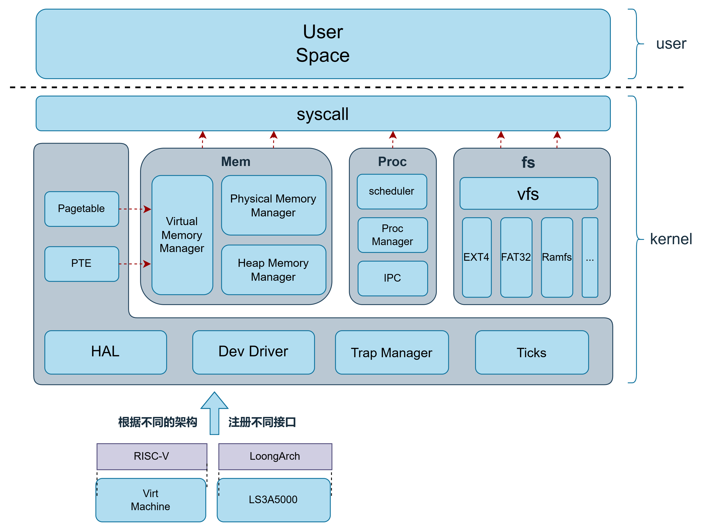

# 🚀 F7LY OS 🚀

## 🌟 文档中心 🌟

- **开发仓库:** 🔗 [GitHub - KidsZZ/F7LY-OS](https://github.com/KidsZZ/F7LY-OS)
    
- **完整设计文档:** 📄 [F7LY_OS设计文档](docs/F7LY_OS设计文档.pdf)
    
- **汇报资料:** 🎬 [PPT和视频](https://pan.baidu.com/s/1FR3LMaC9YEpjRo3k6oIS8A) 提取码: `a8ac`
    

## 💡 F7LY OS 简介 💡

**F7LY OS** 是一款基于 **Xv6** 修改而成的教学用操作系统，支持 **RISC-V** 和 **LoongArch** 双架构⚙️  
它为操作系统开发者提供了丰富的内核模块化设计，涵盖从启动到文件系统的全链路支持。
### 整体架构


## 🛠️ 如何运行 🛠️

### 🚀 通用构建 🚀

```bash
make all      # 同时构建 RISC-V 和 LoongArch 的内核镜像`
```
### 🎯 RISC-V 架构 🎯

- `make run` 启动 RISC-V 内核镜像
    
- `make debug` 使用 QEMU 启动 RISC-V 调试环境
    
- 在另一个终端执行：
```bash
        gdb-multiarch -x debug_riscv.gdb
```
### 🐉 LoongArch 架构 🐉

- `make run ARCH=LOONGARCH` 启动 LoongArch 内核镜像
    
- `make debug ARCH=LOONGARCH` 使用 QEMU 启动 LoongArch 调试环境
    
- 在另一个终端执行：
    
```bash
        loongarch64-linux-gnu-gdb -x debug_loongarch.gdb
```

### 🧹 清理构建文件 🧹

```bash
`make clean`
```

## 🔧 工具链指南 🔧

F7LY OS 需要以下依赖环境：

- **操作系统:** Ubuntu 24.04
    
- **交叉编译器:**
    
    - RISC-V: `riscv64-linux-gnu-*`
        
    - LoongArch: `loongarch64-linux-gnu-*`
        
- **QEMU:** 9.2.1 （需支持 riscv64 和 loongarch64）
    

### 🌐 RISC-V 工具链 🌐

```bash
riscv64-linux-gnu-gcc --version # GCC (Ubuntu 13.3.0-6ubuntu2~24.04) 13.3.0 

 qemu-system-riscv64 --version # QEMU emulator version 9.2.1  

 riscv64-unknown-elf-gdb --version # GNU gdb (GDB) 13.2
```
### 🐲 LoongArch 工具链 🐲

```bash
loongarch64-linux-gnu-gcc --version # GCC (GCC) 13.2.0  

qemu-system-loongarch64 --version # QEMU emulator version 9.2.1  

loongarch64-linux-gnu-gdb --version # GNU gdb (GDB) 12.0.50.20220221-git
```

您可以从以下网站下载 GCC 和 GDB：

- [LoongsonLab/oscomp-toolchains-for-oskernel](https://github.com/LoongsonLab/oscomp-toolchains-for-oskernel/releases)
    
- [LoongsonLab/2k1000-materials](https://github.com/LoongsonLab/2k1000-materials/releases)
    

**提示:** 安装过程中可能需要安装一些动态链接库。

## 📁 目录结构 📁

- **docs/** 📚 存放说明文档
    
- **kernel/** 🧩 内核源文件
    
- **user/** 👤 用户态源文件
    
- **sdcard/** 💽 挂载的文件系统映像（初赛映像文件）
    

## 🔥 代码模块 🔥

**kernel** 目录中对代码进行了模块化分区，支持双架构设计：

- **boot** 🚀 系统启动模块：实现从 Bootloader 到内核 main 的跳转，支持 RISC-V 和 LoongArch 启动流程。
    
- **devs** ⚙️ 设备管理模块：提供统一的设备抽象层，支持 UART、控制台、磁盘等。
    
- **fs** 📂 文件系统模块：VFS 层支持 ext4、FAT、ramfs；包含 inode 管理、目录项缓存等。
    
- **hal** 🖥️ 硬件抽象层：封装 CPU 操作和上下文切换，兼容双架构。
    
- **libs** 📚 内核库模块：字符串操作、内存分配器、模板算法、C++ 运行时等。
    
- **mem** 🧠 内存管理模块：物理内存管理、伙伴系统、虚拟内存、堆分配、slab 分配器。
    
- **proc** 👥 进程管理模块：进程创建、调度、信号、管道、锁等多进程支持。
    
- **sys** 🛎️ 系统调用模块：系统调用分发、参数传递、权限检查。
    
- **trap** ⚡ 中断与异常处理模块：中断向量表、异常处理、时钟中断管理。
    
- **tm** ⏱️ 时间管理模块：定时器管理、时间接口等。
    
- **net** 🌐 网络模块：预留网络协议栈接口。